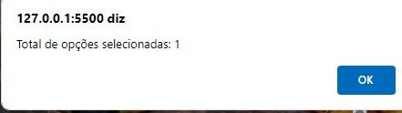

# Laço "For"

# Sobre o site
Nesse trabalho eu tive que implementar o codigo com mais 3 musica do nosso gosto, e melhorar a interface do codigo com CSS, quando você seleciona mais de uma musica aparece uma massengem em cima da tela de quantas musicas foram selecionadas

# O que o codigo faz
 O JavaScript associado ao botão "Quantos foram selecionados?" conta quantas opções foram escolhidas na lista suspensa quando o botão é clicado. Ele utiliza a função howMany, que recebe o objeto de seleção como argumento e percorre todas as opções para determinar quantas estão selecionadas. Em seguida, exibe um alerta com o total de opções selecionadas.

 # Site consutado
 [MDN WEB DOCS](https://developer.mozilla.org/pt-BR/docs/Web/JavaScript/Guide/Control_flow_and_error_handling) 

 # ferramentas utilizadas 
 * Vscode
 * CSS
 * Javascript
 * GitHub

# Pessoas que ajudou no trabalho 
* [Maria yanagui]( https://github.com/mariayanagui)

# Autor
* [Guilherme Serafim](https://github.com/Guilimas2)

